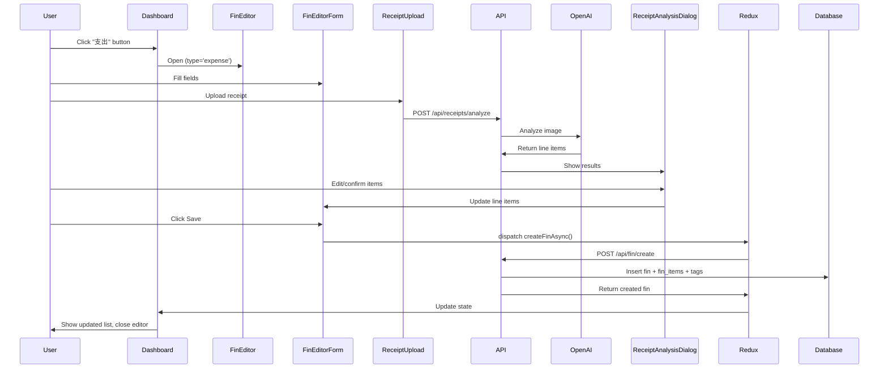
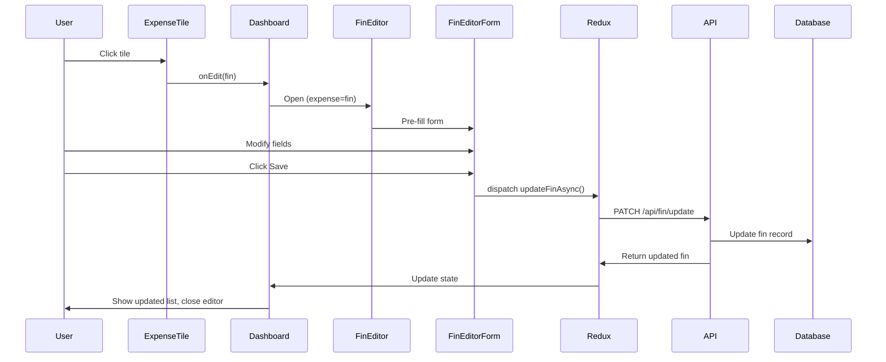

# Fin Editor Feature Specification

> **Status**: Ready for Implementation
> **Last Updated**: 2025-12-29
> **Feature**: Comprehensive expense/income editor with receipt analysis and multi-currency support

## Table of Contents

1. [Overview](#overview)
2. [User Requirements](#user-requirements)
3. [UI Design](#ui-design)
4. [Component Architecture](#component-architecture)
5. [Data Flow](#data-flow)
6. [Implementation Checklist](#implementation-checklist)

---

## Overview

The Fin Editor is a comprehensive financial transaction editor that supports:
- **Dual Transaction Types**: Both expenses and income
- **Multi-Currency**: CAD, USD, CNY with automatic conversion
- **Scheduled Transactions**: Recurring transactions with flexible frequency
- **Receipt Upload**: AI-powered receipt analysis with line item extraction
- **Person Assignment**: Split expenses among family members
- **Tag Management**: Flexible many-to-many tagging system

### Key Features

✅ Mobile-first design with bottom sheet animation
✅ Type-filtered categories (expense vs income)
✅ Cents-based storage for precision
✅ Historical exchange rate tracking
✅ Line item breakdown with person assignment
✅ Dark mode support

---

## User Requirements

### Core Fields
1. **Type**: Expense or Income (pre-set, not changeable in editor)
2. **Date**: ISO 8601 timestamp
3. **Merchant**: Vendor/payer name
4. **Amount**: Displayed in dollars, stored as cents
5. **Currency**: CAD (default), USD, or CNY
6. **Category/Subcategory**: Type-filtered hierarchical selection
7. **Place**: Location/venue
8. **City**: City name
9. **Tags**: Multiple tags with many-to-many relationship
10. **Details**: Free-text notes

### Scheduled Transactions ✅ IMPLEMENTED
- **Toggle**: Expand/collapse frequency options
- **Frequencies**: Daily, Weekly, Biweekly, Monthly, Annually
- **Rule-based**: Auto-creates schedule_rules and generates future occurrences
- **Auto-generation**:
  - Daily/Weekly/Biweekly: 3 years of occurrences
  - Monthly: 10 years (120 occurrences)
  - Annually: 10 years (10 occurrences)
- **Update/Delete Dialog**: Choose "single occurrence" or "all future occurrences"
- **Smart Date Handling**: Properly handles month-end dates (e.g., Jan 31 → Feb 28/29)
- **Dashboard Filtering**: Only shows transactions up to end of current month

### Receipt Analysis
- **Upload**: Drag & drop or click to upload
- **Auto-analyze**: Triggered immediately on upload
- **AI Service**: OpenAI Vision or similar
- **Result Dialog**: Popup with editable line items
- **Person Assignment**: Each item can be assigned to a family member

### User Decisions (Confirmed)

| Aspect | Decision |
|--------|----------|
| **Type Selection** | Two side-by-side buttons ("支出" / "收入"), seamless appearance |
| **Amount Display** | Expenses in red, Income in green |
| **Category Filtering** | Filter by `applies_to` field based on transaction type |
| **Dashboard View** | Combined list with `All` \| `Expenses` \| `Income` filter bar |

---

## UI Design

### Dashboard Layout

```
┌─────────────────────────────────────────────┐
│  [Hero Image with stats]                   │
│                                             │
│  ┌────────────────────────────────────┐    │
│  │  [支出]    [收入]                   │    │ ← Two buttons, seamless
│  └────────────────────────────────────┘    │
│                                             │
│  ╔═══════════════════════════════════╗     │
│  ║ Filter: [All] [Expenses] [Income] ║     │ ← Filter bar
│  ╚═══════════════════════════════════╝     │
│                                             │
│  ┌─────────────────────────────────┐       │
│  │ 🟢 Income │ Salary               │       │
│  │ +$3,500.00  (green)              │       │
│  │ Employer • Dec 29                │       │
│  └─────────────────────────────────┘       │
│                                             │
│  ┌─────────────────────────────────┐       │
│  │ 🔴 Expense │ Food & Dining       │       │
│  │ -$127.50  (red)                  │       │
│  │ Whole Foods • San Francisco      │       │
│  └─────────────────────────────────┘       │
└─────────────────────────────────────────────┘
```

### Editor Layout (Bottom Sheet)

```
┌─────────────────────────────────────────────┐
│  [Close X]  Edit Expense                   │ ← Type in title
│  ─────────────────────────────────────────  │
│                                             │
│  Date: [2025-12-29]                        │
│  Merchant: [Whole Foods]                   │
│  Amount: [127.50] [CAD ▼]                  │
│  Category: [Food & Dining ▼]               │
│  Subcategory: [Groceries ▼]               │ ← Filtered by type
│  Place: [San Francisco, CA]               │
│  City: [CA]                                │
│  Tags: [vacation] [x] [grocery] [x]       │
│                                             │
│  ☐ Scheduled                               │ ← Expandable
│  Details: [Optional notes...]             │
│  Receipt: [Upload or drag & drop]         │
│                                             │
│  ─────────────────────────────────────────  │
│  [Cancel]              [Save]              │
└─────────────────────────────────────────────┘
```

### Animation Specifications

**Bottom Sheet**:
- Initial: `translateY(100%)` (off-screen)
- Animate to: `translateY(0)` (visible)
- Duration: 300ms
- Easing: ease-out
- Backdrop: Fade in simultaneously (0 → 1 opacity)
- Close: Reverse animation (slide down)

---

## Component Architecture

### Component Tree

```
Dashboard
├── CTA Buttons (支出 / 收入)
├── Filter Bar (All | Expenses | Income)
├── Expense List
│   └── ExpenseTile[] (with type, color-coded)
└── FinEditor (conditional)
    └── BottomSheet
        └── FinEditorForm
            ├── Date Input
            ├── Merchant Input
            ├── Amount Input + CurrencySelector
            ├── CategorySelector (filtered by type)
            ├── Place Input
            ├── City Input
            ├── TagInput (multi-tag with chips)
            ├── ScheduledToggle (expandable)
            ├── Details TextArea
            ├── ReceiptUpload
            └── Action Buttons (Cancel / Save / Delete)

ReceiptAnalysisDialog (separate, conditional)
└── Dialog
    └── LineItemEditor[]
        ├── Name Input
        ├── Amount Input
        ├── Person Selector
        └── Remove Button
```

### File Structure

```
app/
├── components/
│   ├── dashboard/
│   │   ├── Dashboard.tsx              ← Modify
│   │   ├── ExpenseTile.tsx            ← Modify (add type, colors)
│   │   ├── FinEditor.tsx              ← New (bottom sheet wrapper)
│   │   ├── FinEditorForm.tsx          ← New (main form)
│   │   ├── ScheduledToggle.tsx        ← New
│   │   ├── CategorySelector.tsx       ← New
│   │   ├── CurrencySelector.tsx       ← New
│   │   ├── TagInput.tsx               ← New
│   │   ├── ReceiptUpload.tsx          ← New
│   │   ├── ReceiptAnalysisDialog.tsx  ← New
│   │   └── LineItemEditor.tsx         ← New
│   └── ui-kit/
│       ├── BottomSheet.tsx            ← New (framer-motion)
│       ├── Dialog.tsx                 ← New
│       ├── Toggle.tsx                 ← New
│       ├── Select.tsx                 ← New
│       ├── TextArea.tsx               ← New
│       └── Tag.tsx                    ← New (chip with X)
├── lib/
│   ├── redux/
│   │   ├── features/fin/finSlice.ts   ← New
│   │   └── store.ts                   ← Modify (add fin reducer)
│   ├── types/
│   │   ├── fin.ts                     ← New
│   │   └── api.ts                     ← Already has CreateFinRequest, etc.
│   └── utils/
│       ├── currency.ts                ← Already exists
│       └── id.ts                      ← Already exists
└── api/
    ├── fin/
    │   ├── create/route.ts            ← Already exists ✅
    │   ├── update/route.ts            ← Already exists ✅
    │   └── [id]/route.ts              ← TODO (GET, DELETE)
    └── receipts/
        └── analyze/route.ts           ← TODO
```

---

## Data Flow

### Create Expense Flow



### Edit Expense Flow



---

## Implementation Checklist

### Phase 1: UI Kit Components (2-3 days)

- [ ] **BottomSheet.tsx** - Bottom sheet with slide-up animation
  - Framer-motion integration
  - Focus trap
  - ESC to close, backdrop click to close
  - Mobile/desktop responsive
- [ ] **Dialog.tsx** - Modal dialog for receipt analysis
- [ ] **Toggle.tsx** - Toggle switch (for scheduled)
- [ ] **Select.tsx** - Dropdown select
- [ ] **TextArea.tsx** - Multi-line input
- [ ] **Tag.tsx** - Tag chip with remove button

### Phase 2: Form Components (3-4 days)

- [ ] **CategorySelector.tsx** - Two-level category picker (filtered by type)
- [ ] **CurrencySelector.tsx** - CAD/USD/CNY dropdown
- [ ] **ScheduledToggle.tsx** - Toggle with expandable frequency options
- [ ] **TagInput.tsx** - Multi-tag input with chips
- [ ] **ReceiptUpload.tsx** - Drag & drop file upload with preview
- [ ] **LineItemEditor.tsx** - Single line item form

### Phase 3: Main Editor (3-4 days)

- [ ] **FinEditorForm.tsx** - Main form component
  - All form fields integrated
  - Form validation
  - Cents conversion (display ↔ storage)
  - Submit handler with Redux dispatch
- [ ] **FinEditor.tsx** - Bottom sheet wrapper
  - Open/close state management
  - Edit mode support
  - Unsaved changes warning
- [ ] **ReceiptAnalysisDialog.tsx** - AI results popup
  - List of line items
  - Edit/confirm/cancel actions

### Phase 4: Redux & API (2-3 days)

- [ ] **finSlice.ts** - Redux state management
  - `createFinAsync`, `updateFinAsync`, `deleteFinAsync`, `fetchFinsAsync`
  - `analyzeReceiptAsync`
  - Selectors
- [ ] **API Routes**:
  - GET `/api/fin` - List with filters
  - GET `/api/fin/[id]` - Single with line items
  - DELETE `/api/fin/[id]` - Delete with cascade
  - POST `/api/receipts/analyze` - AI analysis

### Phase 5: Dashboard Integration (2-3 days)

- [ ] **Dashboard.tsx** - Update with dual buttons and filter
  - Replace single button with "支出" / "收入" buttons
  - Add filter bar (All | Expenses | Income)
  - Wire up FinEditor
  - Fetch fins on mount
  - Apply color coding
- [ ] **ExpenseTile.tsx** - Add type and colors
  - Type prop
  - Color coding (red/green)
  - Type indicator badge
  - Click handler

### Phase 6: Testing & Polish (2-3 days)

- [ ] End-to-end testing (create, edit, delete)
- [ ] Form validation testing
- [ ] Receipt upload & analysis testing
- [ ] Mobile responsive testing
- [ ] Dark mode testing
- [ ] Animations polish
- [ ] Error handling
- [ ] Loading states

---

## Database Schema Reference

### Fin Table
```sql
fin_id TEXT PRIMARY KEY
user_id INTEGER NOT NULL
type TEXT NOT NULL DEFAULT 'expense'  -- 'expense' | 'income'
date TEXT NOT NULL                     -- ISO 8601
merchant TEXT
place TEXT
city TEXT
category TEXT
subcategory TEXT
details TEXT
original_currency TEXT NOT NULL        -- 'CAD' | 'USD' | 'CNY'
original_amount_cents INTEGER NOT NULL -- Stored as cents
fx_id INTEGER                          -- Foreign key to fx_snapshots
amount_cad_cents INTEGER NOT NULL
amount_usd_cents INTEGER NOT NULL
amount_cny_cents INTEGER NOT NULL
is_scheduled INTEGER NOT NULL DEFAULT 0
schedule_rule_id INTEGER               -- Foreign key to schedule_rules
```

### Fin Items Table
```sql
item_id INTEGER PRIMARY KEY
fin_id TEXT NOT NULL                   -- Foreign key to fin
line_no INTEGER
name TEXT NOT NULL
qty REAL
unit TEXT
unit_price_cents INTEGER
original_amount_cents INTEGER NOT NULL
person_id INTEGER                      -- Foreign key to persons
category TEXT
subcategory TEXT
notes TEXT
```

### Tags Tables (Many-to-Many)
```sql
-- tags table
tag_id INTEGER PRIMARY KEY
user_id INTEGER NOT NULL
name TEXT NOT NULL
UNIQUE(user_id, name)

-- fin_tags table (junction)
fin_id TEXT NOT NULL
tag_id INTEGER NOT NULL
PRIMARY KEY (fin_id, tag_id)
```

---

## Success Criteria

### Functional Requirements
✅ User can create expense with all fields
✅ User can create income with all fields
✅ User can toggle scheduled and select frequency
✅ User can select currency (CAD/USD/CNY)
✅ User can add/remove tags
✅ User can upload receipt and see AI-analyzed items
✅ User can edit line items and assign persons
✅ User can edit existing transaction
✅ User can delete transaction with confirmation

### Technical Requirements
✅ All amounts stored as INTEGER cents
✅ Currency conversions accurate
✅ Tags use many-to-many relationship
✅ Person assignment works correctly
✅ FX snapshots created/reused properly

### UX Requirements
✅ Mobile-responsive (bottom sheet)
✅ Desktop-friendly (modal)
✅ Dark mode support
✅ Smooth animations (300ms slide-up)
✅ Form validation prevents invalid input
✅ Error states handled gracefully
✅ Loading states during async operations

---

## API Reference

### Create Fin
```
POST /api/fin/create
Headers: Cookie (auth session)
Body: {
  type: 'expense' | 'income'
  date: string (ISO 8601)
  merchant?: string
  place?: string
  city?: string
  category?: string
  subcategory?: string
  details?: string
  originalCurrency: 'CAD' | 'USD' | 'CNY'
  originalAmountCents: number
  isScheduled?: boolean
  scheduleRuleId?: number
}
Response: { success: true, data: FinData }
```

### Update Fin
```
PATCH /api/fin/update
Headers: Cookie (auth session)
Body: {
  finId: string
  [any field from CreateFinRequest]
}
Response: { success: true, data: FinData }
```

### Analyze Receipt
```
POST /api/receipts/analyze
Headers: Cookie (auth session)
Body: FormData with 'receipt' file
Response: {
  success: true
  lineItems: AnalyzedLineItem[]
  totalAmount: number
  detectedCurrency: string
}
```

---

## Notes & Considerations

### Currency Conversion
- Backend fetches exchange rates and creates FX snapshot
- All three currency amounts calculated and stored
- Frontend only displays, never calculates exchange rates
- Historical accuracy preserved via FX snapshot link

### Tag Management
- Tags are user-specific (user_id + name unique)
- Many-to-many relationship via fin_tags junction table
- Auto-create tags if they don't exist
- Display as chips with remove functionality

### Person Assignment
- Used for line items (split expenses)
- One person per line item (nullable)
- Persons table: user-specific, soft delete via is_active

### Schedule Implementation
- Schedule rules stored separately (schedule_rules table)
- Generated entries link back via schedule_rule_id
- Frequency options: daily, weekly, biweekly, monthly, annually
- Future: Background job to auto-generate scheduled entries

---

**End of Specification**
